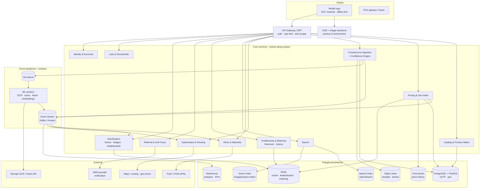

# SmartCart — Scalable Architecture Plan

> "Waze for grocery prices." A consumer-powered grocery price intelligence network
> that gets more valuable in every city as more people contribute data.

This document turns the SmartCart product brain dump into a concrete, scalable
technical architecture. It is written to be **pragmatic at MVP scale (the first
50 users + Atozy soft launch)** while keeping **clean seams so the system can scale
to millions of shoppers across many metros** without a rewrite.

- `ARCHITECTURE.md` (this file) — the full plan.
- [`docs/proven-patterns.md`](proven-patterns.md) — **how Netflix, Meta, Cloudflare, Uber, Waze & AWS solve these exact problems**, mapped onto SmartCart (read this for the "why").
- [`docs/diagrams/system-context.md`](diagrams/system-context.md) — system + container diagrams.
- [`docs/data-model.md`](data-model.md) — core data stores and schemas.
- [`docs/scaling-playbook.md`](scaling-playbook.md) — when/how to scale each component.
- [`docs/roadmap.md`](roadmap.md) — phased build order mapped to the product MVP plan.

> **Provenance:** every major decision below traces to a pattern a hyperscaler proved in
> public — TAO (read-optimized graph cache), H3 (geo-cells), Netflix (resilience/active-active),
> Cloudflare (edge anti-scraping), Waze (crowdsourced trust), cell-based architecture
> (blast-radius isolation). See [`docs/proven-patterns.md`](proven-patterns.md) for the
> evidence and citations.

---

## 1. What we are actually scaling

SmartCart is not a CRUD app. The scale challenges come from four distinct workloads
that have very different shapes, and the architecture exists to keep them isolated so
one can scale (and fail) independently of the others.

| Workload | Shape | Scale driver | Hard parts |
|---|---|---|---|
| **Crowdsourced ingestion** | Write-heavy, bursty, untrusted | Receipts, shelf photos, price corrections, clearance & stock reports, aisle data | OCR/vision cost, deduplication, confidence scoring, abuse |
| **Price intelligence reads** | Read-heavy, geo-filtered, latency-sensitive | Product search, "best nearby price," item detail, deal feed | Geospatial + freshness + anti-scraping |
| **Optimization & routing** | CPU-heavy, bursty, cacheable | Full-cart optimization, multi-store routing, swap suggestions | Combinatorial cost, gas/time tradeoffs, token metering |
| **Alerts & fan-out** | Async, spiky, time-bound | Price-drop alerts, watchlists, deal pushes, geofence triggers | Fan-out to many watchers, dedup, quiet hours |

Everything else (lists, accounts, gamification, referrals, billing) is comparatively
ordinary and rides on top.

### Non-negotiable product constraints that shape the design

These come straight from the brain dump's **Engineering Principles** and become
first-class architectural requirements, not afterthoughts:

1. **Offline-friendly by default** → mobile is offline-first; the list, saved
   products, nearby store info, and last-known prices live on-device.
2. **Fast on low-tier Android, frugal with mobile data** → thin payloads, image
   transforms/CDN, no chatty APIs, on-device caching, optional on-device AI.
3. **Transparent about confidence** → every price carries a `confidence` +
   `as_of` timestamp + `source` through the entire stack to the UI.
4. **Community data improves trust, not noise** → a verification/confidence
   pipeline is a core service, not a column.
5. **Privacy as a product promise** → location/receipt/household data is
   minimized, encrypted, and access-controlled; consumer exports are rate-limited.
6. **Protect the data graph** → anti-scraping is built into the read path; bulk
   data is a separate B2B product, never an accidental consumer export.
7. **Understandable savings** → the optimizer must emit an explainable breakdown
   (swaps / store差 / coupons / −gas), not just a number.

---

## 2. Architecture strategy: modular monolith → targeted service extraction

We will **not** start with 15 microservices for 50 users. Premature distribution
buys operational pain and buys nothing in return.

**Phase 0–1 (MVP, soft launch): a modular monolith + managed cloud primitives.**
One deployable API built as clear, independently-testable **bounded-context modules**
that talk to each other through in-process interfaces (not direct table access).
Async work runs on a queue from day one. Heavy/3rd-party-cost work (OCR, vision,
optimization) is already behind an async boundary so it can be lifted out later.

**Phase 2+ (scale): extract the high-load contexts into their own services** along
the seams we already drew. The extraction order is driven by real load, not
aesthetics — see [`docs/scaling-playbook.md`](scaling-playbook.md).

```
Phase 0/1                          Phase 2+ (extract along seams)
┌─────────────────────────┐        ┌──────────┐ ┌──────────────┐ ┌───────────┐
│   SmartCart API         │   →    │ Ingestion│ │ Optimization │ │  Alerts   │
│ (modular monolith)      │        │  Service │ │   Service    │ │  Service  │
│  catalog | pricing |    │        └──────────┘ └──────────────┘ └───────────┘
│  ingestion | optimize | │        ┌──────────┐ ┌──────────────┐ ┌───────────┐
│  alerts | lists | ...   │   →    │ Catalog/ │ │ Entitlements │ │  Search   │
└─────────────────────────┘        │ Pricing  │ │  & Metering  │ │  Service  │
                                   └──────────┘ └──────────────┘ └───────────┘
```

**The rule that makes this work:** modules own their tables; cross-module access
goes through a published interface and domain events. The day we extract a module,
the interface becomes a network call and the events become a topic — no caller changes.

---

## 3. High-level architecture



---

## 4. Bounded contexts (the modules / future services)

Each is a module now, a service later. Listed with its responsibility, its data,
and the events it publishes.

### 4.1 Identity & Accounts
- Anonymous-first (search/list before signup per onboarding flow), then Apple/Google/email.
- Owns users, devices, sessions, push tokens, permission grants (location/camera/push).
- **Why it matters for scale:** device identity feeds anti-fraud and anti-scraping.

### 4.2 Catalog & Product Match
- Canonical product graph: products, brands, sizes, UPCs, categories, store-brand
  equivalences ("Kroger eggs ≈ Eggland's Best"), swap relationships.
- Resolves barcode / text / image / voice inputs to canonical products.
- Publishes `product.matched`, `product.created` (from "add a product that isn't in the app").

### 4.3 Pricing & Geo Index *(hottest read path)* — **TAO-shaped, H3-keyed**
- "Best nearby price" for a product at a ZIP/location/radius, with confidence + freshness.
- This is SmartCart's **Meta-TAO**: a massively read-dominated lookup over a price/product
  graph. Current price = a **materialized, cached projection** built from ingestion events,
  **never computed live** from raw reports — exactly TAO's "make writes slow so reads are
  trivial" trade.
- **Two-tier cache like TAO:** Redis **follower** cache per metro → regional **leader**/read
  replica → Postgres; a follower miss fills from the leader. **Write-through** on ingestion
  gives the contributor read-after-write; everyone else is eventually consistent.
- **Geo keyed by Uber H3 cells** (not geohash): the H3 cell ID is the shard key, the Redis
  hot-cell key, and the radius-query unit (`kRing`); hierarchical parent cells power
  metro/category roll-ups and the deal feed for free. **PostGIS** still handles exact point
  geometry + geofencing; **time-series store** holds history for charts/trends.
- Publishes `price.updated` (doubles as the cross-region cache-invalidation message, à la
  Netflix EVCache), `price.dropped` (the trigger for alerts).

### 4.4 Crowdsource Ingestion & Confidence Engine *(core moat)*
- Accepts: price corrections, receipts, shelf photos, clearance/markdown reports,
  out-of-stock, aisle/location, coupon observations, aisle-walk videos.
- **Pipeline:** capture → **location-validate** (geofence: was the user at the store?)
  → enqueue → async OCR/vision (receipt parse, shelf-tag read, product match)
  → **dedup & reconcile** → **confidence score** → publish `price.updated`.
- **Confidence scoring is Waze-shaped:** reputation-weighted (a high-karma "Verified Price
  Hunter" ≈ a "Royalty Wazer") + **cross-verified against independent signal** (other recent
  reports, receipt OCR, geofence location-validation) before promotion to `current_price`.
  Agreement raises confidence; disagreement opens a low-confidence/dispute state — never
  silently overwrite verified data. This is the single most important algorithm in the company.
- **Sybil/fraud defense is a first-class input** (device/phone dedup, velocity, SMS identity),
  not a bolt-on — it protects contribution quality, exactly as the Waze literature prescribes.
- **Exactly-once ingestion:** client-generated **idempotency key** per contribution (safe
  retries on bad in-store networks — no double karma/price), **transactional outbox** so events
  are never lost, and **idempotent, replayable** consumers keyed by `(product, store, H3 cell)`
  so scoring can be re-run as the model improves without re-collecting data; **DLQ + manual
  review** for unparseable/abusive submissions.

### 4.5 Optimization & Routing *(CPU-heavy, token-gated)*
- Item-level optimization, full-cart optimization, store-by-store split, multi-stop
  routing with **gas/distance/time** tradeoffs and the **Chill / Balanced / Max Savings** modes.
- Emits the **explainable savings breakdown** (swaps / store差 / coupons / −gas / confidence).
- **Scales via:** async compute + aggressive caching keyed on
  `(normalized cart, location cell, store set, price-data version)`; most carts in a
  metro overlap heavily, so cache hit rate is high. Free "optimization tokens" are
  metered by Entitlements (§4.7).

### 4.6 Alerts & Watchlist
- Watchlists ("stock tracker for groceries"), price-drop alerts, deal pushes, geofence
  entry triggers, "10 users said Publix has ground beef on clearance."
- **Scales via:** consume `price.dropped` / `deal.reported` from the bus → match against
  a **watcher index** (which users watch product X near cell Y) → fan-out through a
  notification service with dedup, batching, quiet-hours, and per-user rate limits.
- Inverted index of watchers (Redis/OpenSearch) avoids scanning all users per event.

### 4.7 Entitlements & Metering *(makes freemium possible at scale)*
- Single source of truth for **plan + earned Premium + token balances**. Every gated
  call (`compare`, `optimize`, `image_search`, `route`, `alert`, `export`) checks here.
- Plans: Free / Premium / **earned Premium** (top contributor week, karma milestones,
  3-referral month, tips).
- Token buckets (e.g. "3 image searches/month", "1–3 cart optimizations/month") as
  **Redis counters with TTL**; durable ledger in Postgres for audit & abuse review.
- Decouples "can the user do this?" from every feature service — gating logic lives once.

### 4.8 Referral & Anti-Fraud
- Referral slots/state machine: `Empty → Invited → Joined → Activated / Ineligible`.
- Encodes the activation predicate exactly as specified (opened-from-referral +
  phone-verified + location/ZIP + ≥3 products or ≥3 searches + not fraud-suspected),
  and reward unlock (≥3 activated + referrer phone-verified → 1 month Premium).
- Anti-fraud: SMS verification, dedupe by phone/device, self-referral block, IP/device
  velocity, VoIP detection (later), spike flagging for manual review. **Start minimal**
  (the doc explicitly says don't overbuild before abuse exists) but isolate it so
  controls can be added without touching the referral happy path.

### 4.9 Gamification
- Karma (weighted by contribution quality/verification), badges, **Weekly/Monthly/All-Time
  leaderboards**, tips.
- **Leaderboards = Redis sorted sets** per window per locale (O(log n) updates,
  cheap top-N reads); periodic snapshot to Postgres for history. Consumes contribution
  events; never computes leaderboards by scanning the DB.

### 4.10 Lists & Households
- Grocery lists, items, quantities, per-item preferences (brand-required / store-brand-ok /
  organic / no-substitution / alert-me), store grouping, in-store checklist state.
- **Households = shared lists** with member roles, item assignment, "who bought this,"
  real-time collaboration (CRDT/last-write-wins sync to support offline + multi-user).
- Offline-first: list is authoritative on-device and syncs; see §6.

---

## 5. Data architecture (polyglot persistence)

One database does not fit these workloads. Each store is chosen for a specific access pattern.

| Store | Used for | Why |
|---|---|---|
| **PostgreSQL** | OLTP: users, lists, products, referrals, entitlement ledger, raw contributions | Relational integrity, the boring stuff that must be correct |
| **PostGIS** (Postgres ext.) | Store locations, "within N miles," geofencing, location validation | First-class geospatial without a new system; partition/shard by metro |
| **Time-series** (Timescale / managed) | Item price history, 30-day tracker, store/category/macro trends | Cheap append, fast range scans, retention/rollups for charts |
| **OpenSearch / Elasticsearch** | Product & deal search, watcher inverted index | Ranked "by usefulness not exact match," typo tolerance, geo filters |
| **Vector index** (pgvector → dedicated) | Image search, "find a matching product" from a photo, swap similarity | Nearest-neighbor on product/image embeddings |
| **Redis** | Hot price cells, leaderboards, token/metering counters, rate limits, sessions | Sub-ms reads; sorted sets & TTL counters fit gamification/metering perfectly |
| **Object storage** (S3/GCS) | Receipts, shelf photos, aisle videos | Cheap blob storage; lifecycle to cold tier; CDN-fronted, transformed |
| **Event stream** (Kafka/Kinesis) | `price.updated`, `contribution.received`, `referral.activated`, … | Decouples producers/consumers; replayable; the integration backbone |
| **Warehouse** (BigQuery/Snowflake) | KPIs (k-factor, activation, cannibalization), cohort analysis, future B2B | OLAP separated from OLTP; the doc's KPI lists are a primary requirement |

**Current price is a projection, not a query.** The read path never aggregates raw
crowdsourced reports live. Ingestion events update a materialized `current_price`
(Postgres row + Redis cache) carrying `value`, `confidence`, `as_of`, `source`. This
keeps the hot read path O(1) and lets us re-derive prices by replaying events when the
confidence model changes.

See [`docs/data-model.md`](data-model.md) for concrete schemas.

---

## 6. Mobile architecture (offline-first, low-end Android, data-frugal)

The product lives in stores with bad signal on cheap phones — the client is part of
the scalability story (every cache hit on-device is a request we don't serve).

- **Offline-first store on device** (SQLite/Realm). The grocery list, saved products,
  chosen stores, and **last-known prices with their `as_of` timestamp** are always
  available offline. Edits queue and sync; lists use CRDT/LWW so household co-editing
  and offline edits merge without conflict loss.
- **Thin, batched APIs / BFF.** The gateway exposes coarse, screen-shaped responses
  (e.g. one call returns the in-store list with prices + coupons + tasks) to avoid
  chatty round-trips on bad networks. Payloads are compact; prices come pre-projected.
- **Images via CDN + on-the-fly transforms.** Never ship full-res; request the exact
  size the device needs. Lazy-load, respect data-saver.
- **On-device AI where it pays for itself.** Barcode decode, the aisle-walk capture
  coach ("walk slowly, capture the aisle sign"), and basic image pre-filtering run
  on-device to cut server cost and latency; heavy OCR/vision stays server-side.
- **Permissions requested just-in-time** (location when confirming a store, camera when
  scanning, push when the user expresses alert intent) — matches the onboarding flow and
  improves grant rates.
- **Confidence is always rendered.** Stale/estimated/crowd-reported prices are visibly
  labeled end-to-end; the client never presents low-confidence data as verified truth.

---

## 7. Geospatial & multi-region scaling

The MVP launches in 4 metros (SLC, DMV, Nashville, Seattle) and the data is intensely
**local** — a price in Seattle is irrelevant to a shopper in Nashville. That locality is
the primary scaling lever.

- **H3 geo-cell sharding (Uber's pattern).** Partition pricing/geo data by **Uber H3 cell**
  (64-bit hierarchical hexagons). The cell ID is the shard key *and* the hot-cache key, so
  load scales horizontally by adding metros instead of getting hotter per metro. Radius
  queries use `kRing`; parent-cell truncation gives metro/category roll-ups for free.
- **The metro is a *cell* (AWS/DoorDash cell-based architecture).** Each metro is a
  self-contained cell with its **own DB partition, cache tier, and capacity** — a failure in
  Seattle cannot affect Nashville (bulkhead). **New city = add a cell** (seed stores), not a
  schema change or re-shard. This maps 1:1 onto the "more valuable in each city" thesis and
  gives **linear, low-blast-radius scale**. Deploys are **cell-aware**: ship risky changes to
  one metro-cell first, bake, auto-rollback on alarm, then progress.
- **Single region until traffic justifies more (Netflix's path).** Start in one cloud region;
  Netflix itself wasn't born active-active. But the **cross-region cache-invalidation mechanism
  is wired from day one** — `price.updated` *is* the EVCache/SQS invalidation message — so
  flipping on multi-region active-active later is a config change, not a rewrite.

---

## 8. Protecting the data graph (anti-scraping) & privacy

The data graph **is** the company; the brain dump explicitly calls out competitors trying
to extract it and the dynamic-pricing/"surveillance pricing" narrative the product fights.

- **Anti-scraping as a Cloudflare-style edge bot-score system** (not a rate-limit afterthought):
  score each read from layered signals — device attestation, per-device/account velocity, and
  **H3 geo-coherence** (one account "shopping" across 20 distant cells is extraction, not
  shopping) — then block / challenge / rate-limit on the score. Run the read path + hot H3 cells
  + images at the **edge**, which also serves "fast on bad networks." **No bulk price export
  through consumer APIs**; exports are rate-limited and watermarked.
- **Bulk data is a separate B2B product**, never an accidental consumer feature — exactly
  as the export section warns.
- **Privacy by design:** minimize PII; encrypt receipts/location/household data at rest;
  strip PII from receipts post-parse; short retention on raw location; per-user data
  access & deletion paths. Location is used for *value to the user* (right list, local
  prices, validation) and that intent is stated in copy.
- **Fraud/abuse signals stay server-side**; users see friendly statuses ("Couldn't count
  this invite"), never the detection logic.

---

## 9. Security, observability, reliability

- **AuthN/Z:** OIDC social login + anonymous device tokens; short-lived access tokens;
  entitlements checked server-side on every gated action (never trust the client's plan).
- **Secrets & isolation:** managed secrets, least-privilege per service, network isolation
  for ML workers handling receipts.
- **Observability from day one:** structured logs, traces across the async pipeline (a
  receipt's journey capture→OCR→confidence→price→alert is one traceable flow), RED/USE
  metrics per module, and the **product KPI pipeline** (referral funnel, k-factor,
  activation, paywall cannibalization, SMS funnel) landing in the warehouse — these KPIs
  are explicit product requirements, so instrument the events that feed them up front.
- **Reliability (Netflix patterns, made explicit):** every remote dependency (optimizer,
  maps/gas, OCR) sits behind a **circuit breaker with a fallback** — optimizer down → serve
  last-known cached cart plan; pricing degraded → serve on-device last-known price with its
  `as_of` label. **Bulkheads** (the metro-cells) stop one failure spreading. The async backbone
  absorbs ingestion/optimization spikes; consumers are idempotent and replayable. In Phase 2,
  **chaos game-days** inject failure (queue backups, a dead metro-cache, OCR timeouts) to prove
  resilience rather than assume it.

---

## 10. Recommended starting tech stack

Chosen for small-team velocity now and a clean path to scale later. Substitute equivalents
freely — the *boundaries* matter more than the brands.

- **Mobile:** one cross-platform codebase (React Native or Flutter) to hit iOS + low-end
  Android from a small team, with native modules for barcode/camera/on-device ML.
- **Backend:** a single typed service to start — **TypeScript/NestJS** or **Go** (Go if
  the team leans performance/concurrency for ingestion fan-out). Modular-monolith layout
  with one module per bounded context in §4.
- **Data:** Postgres + PostGIS + pgvector + TimescaleDB (one managed Postgres family covers
  OLTP, geo, vectors, and time-series at MVP — split out as load grows), Redis, OpenSearch,
  S3-compatible object storage + CDN, Kafka/Kinesis when async volume warrants (a managed
  queue like SQS is fine on day one).
- **ML/AI:** start with managed APIs (receipt OCR, vision, embeddings, LLM for product
  matching/normalization) behind the ML-worker boundary; bring models in-house only when
  volume/cost/privacy demands it.
- **Infra:** containers on a managed platform (ECS/Cloud Run/Fly) + IaC; one region first.

---

## 11. Phased roadmap (mapped to the product MVP plan)

Aligned to the brain dump's rollout: **First 50 (friends & family) → Atozy soft launch →
multi-metro growth.** Full detail in [`docs/roadmap.md`](roadmap.md).

- **Phase 0 — Walking skeleton (first 50 users, 1 metro).** Modular monolith; Postgres +
  PostGIS + Redis + object storage + a managed queue. Anonymous-first onboarding, list
  building, search, current-price projection, manual price contribution + receipt upload
  (OCR via managed API), single-store basic comparison, basic 30-day tracker, karma counter.
  Goal: prove the "aha" and the savings number, learn which features matter (per the doc's
  "what we need to learn").
- **Phase 1 — Soft launch (Atozy audience, still mostly monolith).** Add Entitlements &
  metering (tokens + Premium), full-cart optimization + Chill/Balanced/Max routing with the
  explainable breakdown, price-drop alerts + watchlists, referral + SMS verification + basic
  fraud, leaderboards/badges, in-store mode with crowdsource tasks. Stand up the KPI warehouse
  pipeline (k-factor, activation, cannibalization holdout).
- **Phase 2 — Multi-metro scale.** Extract the load-bearing seams in order: **Ingestion +
  Confidence**, then **Optimization**, then **Alerts**, then **Pricing/Search** — each when
  its scaling trigger fires. Geo-cell sharding, OpenSearch/vector search at scale, multi-region
  reads as needed. Harden anti-scraping. Tip/payments, exports, household at scale.
- **Phase 3 — Moat & monetization.** Macro price-trend analytics, separate **B2B data
  product**, deeper on-device AI, advanced fraud, POV-glasses capture surface.

> **Guiding principle:** build the *seams* in Phase 0, not the *services*. We earn the right
> to distribute a component by hitting its scaling trigger — never before.
