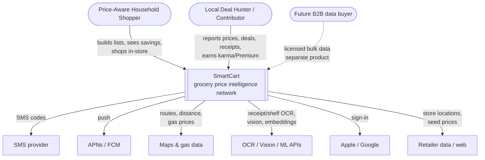
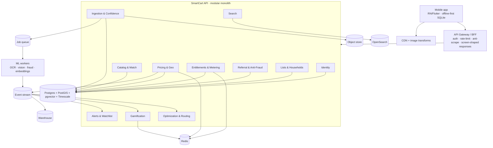

# SmartCart — System & Container Diagrams

C4-style views. Render the Mermaid blocks in any Mermaid-capable viewer
(GitHub renders them natively).

## C1 — System context



## C2 — Containers (Phase 1; modules become services in Phase 2)



## Key request flows

**Build list → see savings (read-hot path)**
```
App → GW(authz, rate-limit) → Lists(add item)
   → Catalog(resolve product) → Pricing(best nearby price = cached projection, w/ confidence)
   → Entitlements(token check for optimization) → Optimization(cached cart plan + breakdown)
   → screen-shaped response back to App
```

**Contribute a price/receipt (write path, async)**
```
App → GW → Ingestion(capture + geofence location-validate) → Object store(photo)
   → Queue → ML worker(OCR/vision, product match) → Confidence Engine(score)
   → emit price.updated → Pricing projection update + Redis cache bust
   → emit contribution.received → Gamification(karma/leaderboard) + Entitlements(token reward)
   → if crosses threshold: emit price.dropped → Alerts(watcher fan-out → push)
```

**Referral activation**
```
Friend opens referral link → Identity(attribute) → enters ZIP + searches/adds 3
   → SMS verify → Referral evaluates activation predicate
   → on 3 activated + referrer verified: Entitlements grants 1 month Premium
```
